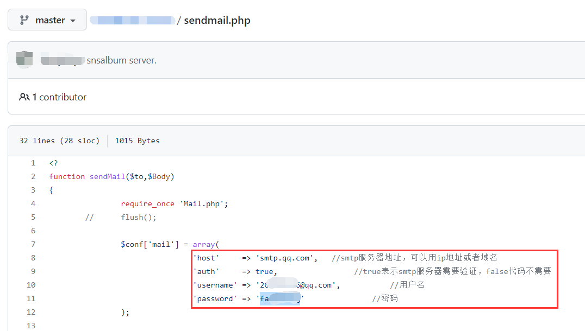
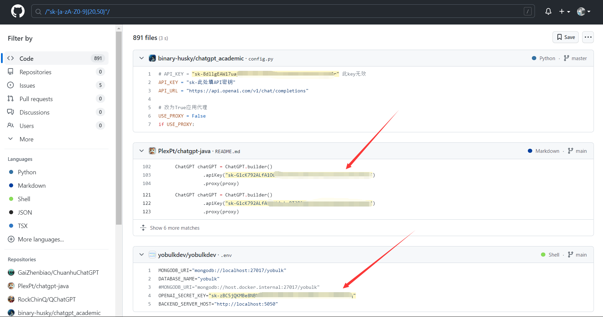

# Open-Source-Information-Leakage

开源项目信息泄露笔记，博客地址：[https://blog.zgsec.cn/archives/205.html](https://blog.zgsec.cn/archives/205.html)

**本笔记内容会持续更新，欢迎各位师傅点个Star支持和补充完善~🥰**

## 0# 概述与现状

当我们对一些项目进行渗透、审计的时候，以及HW红蓝攻防时，对目标的开源项目信息泄露就是重要一环，这也是开源情报（Open-Source Intelligence，OSINT）信息搜集的一部分

### 整体现状

2020年春，Unit 42研究人员通过GitHub Event API 分析了超过24,000份GitHub公开数据，发现有数千个文件中可能包含敏感信息


在24,000份GitHub公开数据中，存在以下泄露：

- 4109个配置文件
- 2464个API密钥
- 2328个硬编码的用户名及密码
- 2144个私钥文件
- 1089个OAuth令牌

总体占比高达50.56%，想想开源项目信息泄露有多可怕吧

### 对于企业而言

很多企业的开源项目信息泄露，都是企业的实习生或新入职的员工造成的。他们往往会把自己里在公司负责的一个小项目给 push 到 GitHub 上，或者是将长久以来的技术总结文章发到 GitHub 上进行汇总管理，这些文章中难免包含很多公司的数据库配置，网络拓扑，服务器信息等（这种信息泄露在小公司尤为常见）

虽然有部分公司选择使用 GitLab 等来自建 Git 远程仓库，但是同样未正确设置仓库权限为私有。导致在 `/explorer` 中可以看到所有的公开仓库，同时可以通过查看公开的 Groups 来得知有哪些用户，之后可以尝试爆破猜测它们的密码等等，可见自建 Git 仓库也并不是万全之计。

### 对于个人开发者而言

除企业员工外，还有一群就是个人开发者（特别是高校学生），他们的开源项目信息泄露也尤为严重。很多高校学生，平时喜欢自己写些脚本。比如选课脚本、图书馆通知、刷课脚本等开源项目，往往未对相关的代码进行脱敏，就把源码 push 到 GitHub 上。

于是，就造成这样的情况：写 Web 应用需要对接数据库，代码里会有 MySQL 的数据库账号配置；要发邮件通知，代码里就有个人学生邮箱账号密码；测试数据里可能还带有个人的常用密码；甚至还有一些校园VPN的账号密码等。

有的做得比较大的项目，可能会对接微信小程序、公众号，某教育 App 等第三方应用，甚至一些云厂商的服务，因此还会泄露这些服务的 AK 和 SK。所以，开源项目虽方便了企业和开发者，但其中也埋藏着信息泄露的安全隐患。


## 1# Google搜索语法

### 简单的一些Google语法

```
site      #指定域名进行搜索，如site:aabyss.cn（收集团队子域名）
intext    #正文中存在关键字的网页，如intext:管理登录（查找包含“管理员登录”关键词的网页）
intitle   #标题中存在关键字的网页，如intitle:管理登录（查找后台管理登陆界面）
info      #一些基本信息
inurl     #URL存在关键字的网页，如inurl:file（查找url上含file的网址寻找上传漏洞）
filetype  #搜索指定文件类型，如filetype:php（查找php类型主页）
```

### 邮件配置信息泄露

很多网站及系统都会使用POP3和SMTP发送来邮件，不少开发者由于安全意识不足会把相关的配置信息也放到Github上。

如果这时候我们动用一下Google搜索命令语句，构造一下关键字，就能把这些信息给找出来了。

```
site:Github.com smtp
site:Github.com smtp @qq.com
site:Github.com smtp @126.com
site:Github.com smtp @163.com
site:Github.com smtp @sina.com.cn
site:Github.com smtp password
site:Github.com String password smtp
```



### 数据库信息泄露

```
site:Github.com sa password              #争对SQLServer的信息泄露
site:Github.com root password            #争对MySQL的信息泄露
site:Github.com User ID='sa';Password    #争对SQLServer的信息泄露
```

### Github之svn信息泄露

```
site:Github.com svn
site:Github.com svn username
site:Github.com svn password
site:Github.com svn username password
```

### 数据库备份文件

```
site:Github.cominurl:sql
```

### 综合信息泄露

```
site:Github.com password
site:Github.com ftp ftppassword
site:Github.com 密码
site:Github.com 内部
```

### 配合用法

```
1、找管理后台地址
site：xxx.com intext:管理|后台|登陆|用户名|密码|系统|账号
site：xxx.com inurl:login/admin/manage/manager/admin_login/system
site：xxx.com intitle:管理|后台|登陆

2、找上传类漏洞地址：
site:xxx.com inurl:file
site:xxx.com inurl:upload

3、找注入页面:
site:xxx.com inurl:php?id=

4、找编辑器页面：
site:xxx.com inurl:ewebeditor

5、找登录页面
site:xxx.com inurl:"/admin/login.php"

6、查找含有username或password的xls文件
filetype:xls "username | password"
```


## 2# Github高级搜索

网上大部分文章都是使用Google语法来搜索，目前还没看到国内有人使用Github进行高级搜索来查找信息泄露的文章

高级搜索链接：https://github.com/search/advanced

> 一般搜索以域名、特殊JS路径、备案、网站的技术支持等**关键内容**为主，**不要局限于域名**

我们可以活用 GitHub 的高级搜索条件，可以避免很多不必要的干扰，这里就整理了一些：

### 过滤时间

```
pushed:>2020-01-01 created:>2020-01-01
```

使用过滤器过滤掉一些很老的代码

### 筛选代码语言

```
language:java
```

筛选特定语言（诸如Java）的代码，排除搜索结果中静态文件的干扰

### 数据库连接关键词

```
"jdbc:mysql://"
"mysqli_connect("
```

搜索数据库连接语句，往往就能有很多公网数据库的账号密码


### 敏感文件名

```
filename:.env
filename:bash_history
filename:_rsa
filename:jenkins.plugins.publish_over_ssh.BapSshPublisherPlugin.xml 
```

这个总能找到一些奇奇怪怪的东西，甚至是数字证书（之前就找到国内某大学的VPN数字证书，然后就通过VPN进入内网）

### 阿里云key

```
aliyuncs password
```


对于企业而言，可以搜索企业的内网、外网域名，企业邮箱，版权声明（一般会写在代码首部注释），常用包名等

思路其实可以放的很广

### ChatGPT密钥
最近ChatGPT不是火遍海内外吗，很多师傅都想尝试一下
同样，格局和思路要打开，通过Github高级语法同样能找到并白嫖ChatGPT密钥
 **（注：本文仅提供思路，请遵守当地法律进行使用）**
 
 ```
/"sk-[a-zA-Z0-9]{20,50}"/
```



## 3# 正则表达式（部分内容来自互联网）

正则表达式在开源情报搜集中占了很大的一部分，所以打算整理整理

正则表达式，又称规则表达式（Regular Expression，在代码中常简写为regex、regexp或RE），是一种文本模式，包括普通字符（例如，a 到 z 之间的字母）和特殊字符（称为"元字符"），是计算机科学的一个概念。

**正则表达式使用单个字符串来描述、匹配一系列匹配某个句法规则的字符串，通常被用来检索、替换那些符合某个模式（规则）的文本**

### 正则表达式的规则

#### 1.`[]`:表示一个字符,该字符可以是[]中指定的内容

```less
[abc]：这个字符可以是a或b或c
[a-z]：表示任意一个小写字母
[a-zA-Z]：表示任意一个字母
[a-zA-Z0-9_]：表示任意一个数字字母下划线
[^abc]：该字符只要不是a或b或c
```

#### 2.预定义字符

```less
. :表示任意一个字符,没有范围限制
\d :表示任意一个数字,等同于[0-9]
\w :表示任意一个单词字符,等同于[a-zA-Z0-9_]–单词指字母/数字/_
\s :表示任意一个空白字符
\D :表示不是数字
\W :不是单词字符
\S:不是空白字符
```

#### 3.量词

```less
? :表示前面的内容出现0-1次
例如: [abc]? 可以匹配:a 或 b 或 c 或什么也不写

+ :表示前面的内容最少出现1次
  例如: [abc]+ 可以匹配:b或aaaaaaaaaa…或abcabcbabcbabcba…
  但是不能匹配:什么都不写 或 abcfdfsbbaqbb34bbwer…

: 表示前面的内容出现任意次(0-多次)—匹配内容与+一致，只是可以一次都不写
例如: [abc]* 可以匹配:b或aaaaaaaaaa…或abcabcba…或什么都不写
但是不能匹配:abcfdfsbbaqbb34bbwer…

{n} :表示前面的内容出现n次
例如: [abc]{3} 可以匹配:aaa 或 bbb 或 aab 或abc 或bbc
但是不能匹配: aaaa 或 aad

{n,m} :表示前面的内容出现最少n次最多m次
例如: [abc]{3,5} 可以匹配:aaa 或 abcab 或者 abcc
但是不能匹配:aaaaaa 或 aabbd

{n,} :表示前面的内容出现n次以上(含n次)
例如: [abc]{3,} 可以匹配:aaa 或 aaaaa… 或 abcbabbcbabcba…
但是不能匹配:aa 或 abbdaw…
```

#### 4.()用于分组,是将括号内的内容看做是一个整体

```less
(abc){3} 表示abc整体出现3次. 可以匹配abcabcabc
但是不能匹配aaa 或abcabc

(abc|def){3}表示abc或def整体出现3次.
可以匹配: abcabcabc 或 defdefdef 或 abcdefabc
但是不能匹配abcdef 或abcdfbdef
```

### 常用的正则表达式

#### 1.邮箱演示：


#### 2.数字校验：

```
数字：^ [0-9]*$
n位的数字：^\d{n}$
至少n位的数字：^\d{n,}$
m-n位的数字：^\d{m,n}$
零和非零开头的数字：^(0|[1-9][0-9]*)$
非零开头的最多带两位小数的数字：^([1-9][0-9]*)+(.[0-9]{1,2})?$
带1-2位小数的正数或负数：^(-)?\d+(.\d{1,2})?$
正数、负数、和小数：^(-|+)?\d+(.\d+)?$
有两位小数的正实数：^ [0-9]+(.[0-9]{2})?$
有1~3位小数的正实数：^ [0-9]+(.[0-9]{1,3})?$
非零的正整数：^ [1-9]\d*$ 或 ^([1-9][0-9]){1,3}$ 或 ^+?[1-9][0-9]$
非零的负整数：^-[1-9][]0-9"$ 或 ^-[1-9]\d$
非负整数：^\d+$ 或 ^ [1-9]\d*|0$
非正整数：^-[1-9]\d*|0$ 或 ^((-\d+)|(0+))$
非负浮点数：^\d+(.\d+)?$ 或 ^ [1-9]\d*.\d*|0.\d*[1-9]\d*|0?.0+|0$
非正浮点数：^((-\d+(.\d+)?)|(0+(.0+)?))$ 或 ^(-([1-9]\d*.\d*|0.\d*[1-9]\d*))|0?.0+|0$
正浮点数：^ [1-9]\d*.\d*|0.\d*[1-9]\d*$ 或 ^ (([0-9]+.[0-9][1-9][0-9])|([0-9][1-9][0-9].[0-9]+)|([0-9][1-9][0-9]))$
负浮点数：^-([1-9]\d*.\d*|0.\d*[1-9]\d*)$ 或 ^(-(([0-9]+.[0-9][1-9][0-9])|([0-9][1-9][0-9].[0-9]+)|([0-9][1-9][0-9])))$
浮点数：^(-?\d+)(.\d+)?$ 或 ^-?([1-9]\d*.\d*|0.\d*[1-9]\d*|0?.0+|0)$
```

#### 3.验证字符：

```less
汉字 ：^ [\u4e00-\u9fa5]{0,}$
英文和数字：^ [A-Za-z0-9]+$ 或 ^ [A-Za-z0-9]{4,40}$
长度为3-20的所有字符：^.{3,20}$
由26个英文字母组成的字符串：^ [A-Za-z]+$
由26个大写英文字母组成的字符串：^ [A-Z]+$
由26个小写英文字母组成的字符串：^ [a-z]+$
由数字和26个英文字母组成的字符串：^ [A-Za-z0-9]+$
由数字、26个英文字母或者下划线组成的字符串：^\w+$ 或 ^\w{3,20}$
中文、英文、数字包括下划线：^ [\u4E00-\u9FA5A-Za-z0-9_]+$
中文、英文、数字但不包括下划线等符号：^ [\u4E00-\u9FA5A-Za-z0-9]+$ 或 ^ [\u4E00-\u9FA5A-Za-z0-9]{2,20}$
```

#### 4.其他常用验证

```less
1.域名：[a-zA-Z0-9][-a-zA-Z0-9]{0,62}(/.[a-zA-Z0-9][-a-zA-Z0-9]{0,62})+/.?

2.手机号码：^(13[0-9]|14[5|7]|15[0|1|2|3|5|6|7|8|9]|18[0|1|2|3|5|6|7|8|9])\d{8}$

3.身份证号(15位、18位数字)：^\d{15}|\d{18}$

4.密码(以字母开头，长度在6~18之间，只能包含字母、数字和下划线)：^ [a-zA-Z]\w{5,17}$

5.日期格式：^\d{4}-\d{1,2}-\d{1,2}

6.一年的12个月(01～09和1～12)：^(0?[1-9]|1[0-2])$

7.一个月的31天(01～09和1～31)：^((0?[1-9])|((1|2)[0-9])|30|31)$

8.xml文件：^([a-zA-Z]±?)+[a-zA-Z0-9]+\.[x|X][m|M][l|L]$

9.中文字符的正则表达式：[\u4e00-\u9fa5]

10.QQ号：[1-9][0-9]{4,} (腾讯QQ号从10000开始)

11.中国邮政编码：[1-9]\d{5}(?!\d) (中国邮政编码为6位数字)

12.IP地址：\d+.\d+.\d+.\d+ (提取IP地址时有用)

13.IP地址：(( ? : ( ?:25[0-5]|2[0-4]\d|[01]?\d?\d)\.){3}(?:25[0-5]|2[0-4]\d|[01]?\d?\d))

14.文件扩展名效验:^([a-zA-Z]\: |\\)\\([^\\]+\\)* [ ^ \/: * ?"<>|]+\.txt(l)?$
```

## 4# 敏感信息泄露监控工具的推荐

关于相关的工具，我这里推荐使用这三个，是我用过感觉蛮好的

三个工具各有特点，可以依据使用者的条件和喜好自行选择

关于工具的搭建和配置，在百度和Google上很多文章都有写，笔者这里就不重复了

### GitMAD

开源地址： [https://github.com/deepdivesec/gitmad](https://github.com/deepdivesec/gitmad) 

GitMAD是一个用于发现Github上的敏感信息和数据泄漏的工具。通过给定关键字或域，GitMAD便会搜索Github上托管的代码，以查找是否存在匹配项。一旦找到了匹配项，GitMAD将克隆存储库并在文件中搜索一系列可配置的正则表达式。

然后，GitMAD会获取这些结果，并将它们插入到数据库中供后续的查看使用。这些结果也可作为邮件警报发送。另外，GitMAD将持续运行以发现与输入关键字匹配的新存储库。

### GSIL

开源地址： [https://github.com/FeeiCN/GSIL/](https://github.com/FeeiCN/GSIL/) 

此工具主要用于GitHub敏感信息泄露的监控，可实现邮件实时告警，缺点不是可视化

### GShark

开源地址： [https://github.com/madneal/gshark](https://github.com/madneal/gshark) 

这是个可视化的监测工具，它不仅可以监控 `Github`，还可以监控 `Gitlab`

- 支持多个搜索平台，包括 Github，Gitlab（不稳定支持），Searchcode
- 灵活的菜单以及 API 权限管理
- 灵活的规则以及过滤规则设置
- 支持 gobuster 作为子域名爆破的支持
- 方便易用
